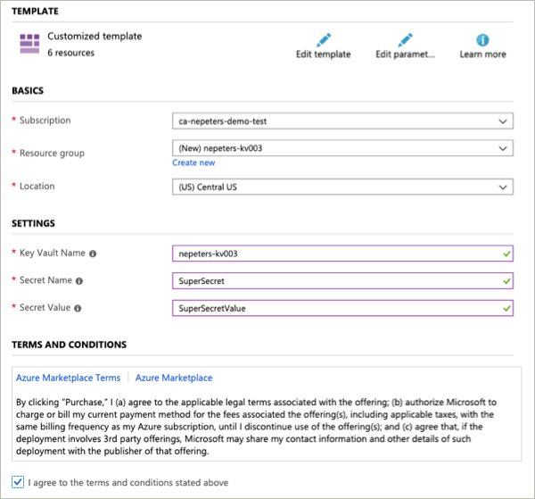

# Deploy Key Vault and Access from Bootstap Container

This template deployed Aure Key Vault, creates a secret, and returns the secret from a script running inside of the bootstrapping contianer. Authentication is provided by the MSI based identity given to the cotnainer.

# Validate test

Fill our the form and click purchase.

Once the deployment has completed, select the container >

